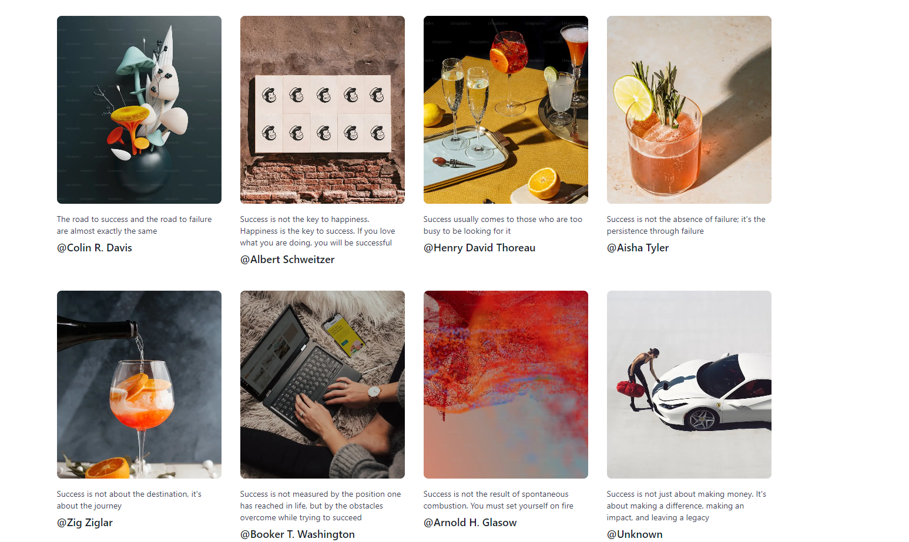

Apologies for the confusion. Here's the code for the `README.md` file alone:

```markdown
# Portfolio Project - Image Gallery

This project is a simple image gallery built with Next.js and Supabase.

## Live UI Showcase



## Description

The Image Gallery is a web application that allows users to view a collection of images. Each image is associated with a name and username. Users can click on the images to view more details.

## Tech Stack

- Next.js
- Supabase
- Tailwindcss
- Typescript

## Installation

To run this project locally, follow these steps:

1. Clone the repository:

   ```bash
   git clone https://github.com/alb1nut/image-gallery.git
   cd image-gallery
   ```

2. Install dependencies:

   ```bash
   npm install
   ```

3. Start the development server:

   ```bash
   npm run dev
   ```

The project should now be accessible at `http://localhost:3000`.

Feel free to explore and update the code in this repository and check out the live UI to see the image gallery in action!

Happy coding!
```

